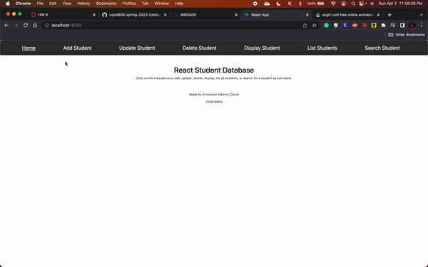

# Studentserver.js with React

#### Emmanuel David / Z23619905

##### This assignment is using the studentserver.js server from previous assignments and I was able to connect it to a react app as the front end. In doing this, I was able to:

* Add a student to the MongoDB Database
* Display a single student and provide
* Updating a single student
* Deleting a student
* Listing all the students
* Search for a student by last name

##### All while providing the user with a notification showing whether it was successful or not and showing the results in a user friendly table.

For this project, I used React.js, Express.js, Node.js, Cors, Axios, and Bootstrap.
